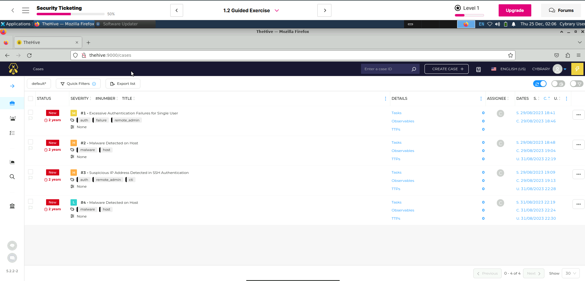
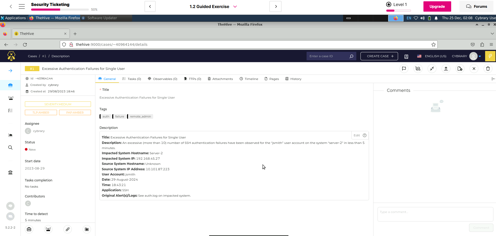
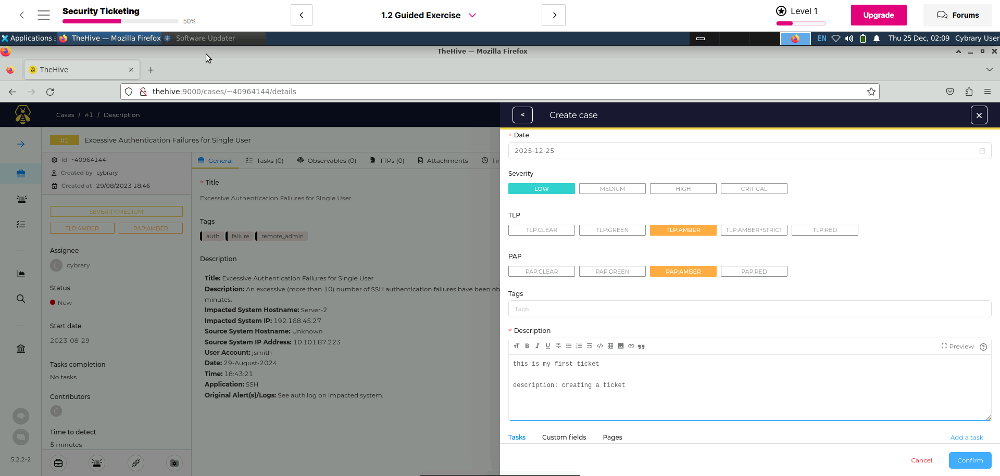
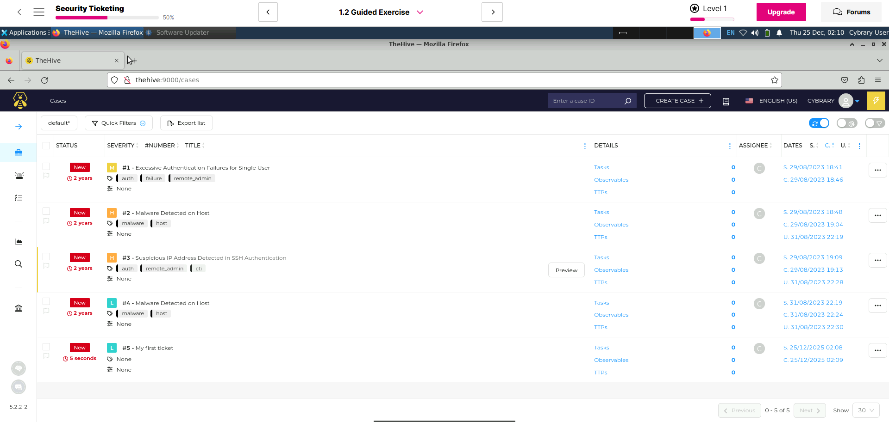
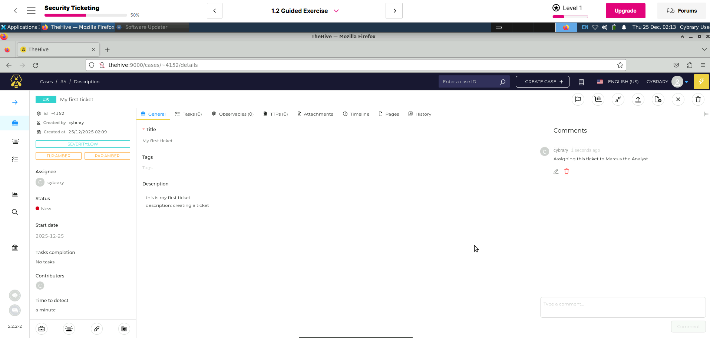
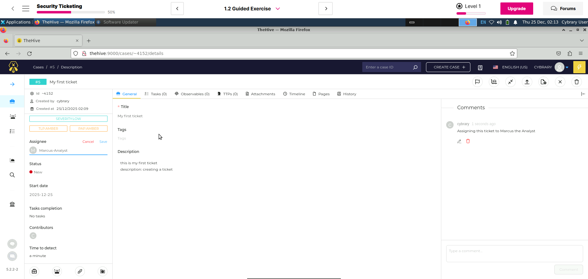
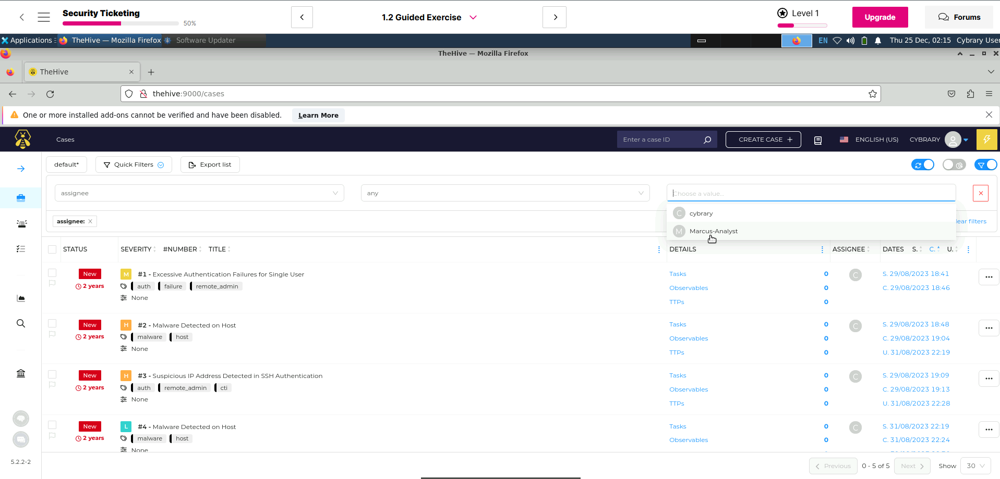
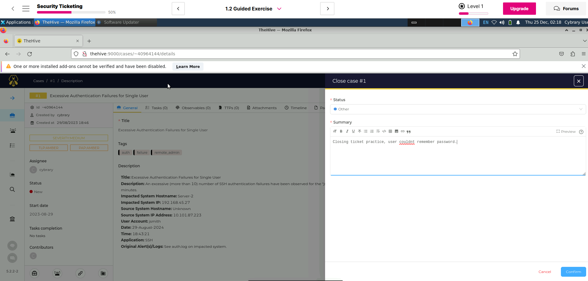

# 🛡️ Security Ticketing & Incident Workflow Lab (Cybrary)

This lab demonstrates hands-on experience working with a **security ticketing and incident management system** using **Cybrary’s Security Ticketing Guided Exercise**. The focus is on **ticket creation, triage, investigation, assignment, and closure**, mirroring real-world **SOC Tier 1 / IT Security Operations** workflows.

The exercise was performed using **TheHive**, a widely used open-source **Security Incident Response Platform**, to simulate realistic security alerts and analyst actions.

---

## 🧠 Lab Objectives

- Practice **security ticket lifecycle management**
- Understand how alerts are **documented, classified, and prioritized**
- Apply **severity, TLP, and PAP tagging**
- Assign tickets to analysts and track ownership
- Properly **close incidents with clear summaries**
- Build experience aligned with **SOC / IT Help Desk / Security Operations roles**

---

## 🧾 Ticket Walkthrough (Screenshots & Actions)

---

### 🔍 Ticket Dashboard Overview
**Purpose:** View all incoming security cases and identify priority incidents.

**What this demonstrates**
- Awareness of multiple concurrent incidents
- Understanding severity indicators and alert categories
- Familiarity with SOC-style dashboards

---

### 🚨 Ticket #1 – Excessive Authentication Failures
**Scenario:** Multiple SSH authentication failures for a single user in a short timeframe.

**Actions Taken**
- Reviewed alert metadata (user, source IP, host)
- Identified potential brute-force or credential misuse
- Documented impacted system and user account

---

### 📝 Creating a New Security Ticket
**Purpose:** Manually create a ticket to document a security event.

**Actions Taken**
- Created a new case with appropriate date and description
- Applied severity and TLP/PAP classification
- Practiced clear and structured ticket documentation

---

### 📂 Ticket List with New Case Added
**Purpose:** Confirm ticket creation and visibility in the queue.

---

### 📄 Ticket Details – Documentation Review
**Purpose:** Review and validate ticket details.

**Actions Taken**
- Verified title, severity, and description
- Ensured clarity for downstream analysts
- Maintained audit-ready documentation

---

### 👤 Assigning Ticket to an Analyst
**Purpose:** Demonstrate ownership and escalation workflow.

**Actions Taken**
- Assigned ticket to an analyst role
- Practiced SOC-style handoff procedures
- Demonstrated accountability and workflow management

---

### 🔎 Filtering Tickets by Assignee
**Purpose:** Locate tickets based on analyst responsibility.

---

### ✅ Closing the Ticket with Resolution Summary
**Purpose:** Finalize incident after resolution.

**Actions Taken**
- Closed the case with a documented summary
- Practiced professional closure notes
- Completed the incident lifecycle

---

## 📈 Final Thoughts

This project demonstrates **practical, hands-on experience** with workflows used in:

- Security Operations Centers (SOC)
- IT Help Desk and Tier 1 Security roles
- Incident Response teams
- Managed Security Service Providers (MSSPs)

It shows how:
- Alerts become tickets  
- Tickets become investigations  
- Investigations become documented outcomes  

---

## 🚀 Future Enhancements

- Map incidents to MITRE ATT&CK techniques
- Simulate Tier 2 escalation workflows

---

## 📌 Lab Source

- **Platform:** Cybrary  
- **Course:** Security Ticketing – Guided Exercise  
- **Tool Used:** TheHive  
